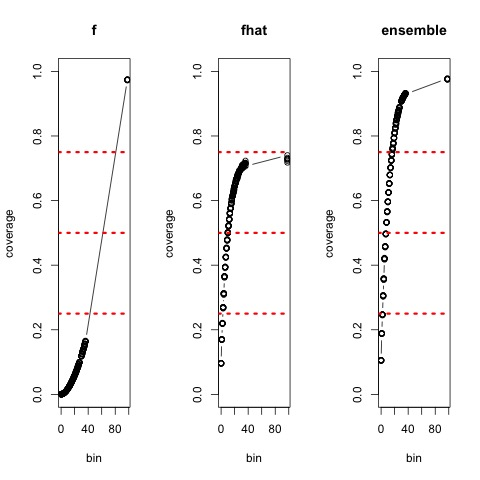
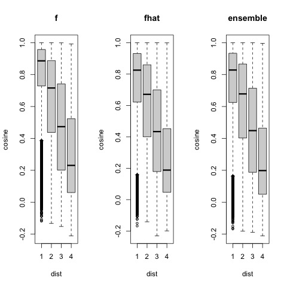
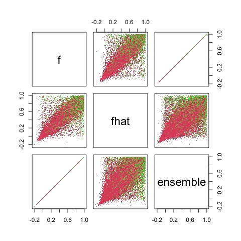

# Measurements of ProNE by bin

<ol>
<li><b>f</b>: use ProNE vectors for the two input corpus ids</li>
<li><b>fhat</b>: use the centroid approximation to estiamte vectors for the two input corpus ids</li>
<li><b>ensemble</b>: use f when it is available, and otherwise use fhat</li>
</ol>

<h2>Materials</h2>

See walk_with_bins on <a href="https://app.globus.org/file-manager?origin_id=1ef9019c-eac0-11ed-9ba9-c9bb788c490e&origin_path=%2F~%2Fsemantic_scholar%2Feval%2F">Globus</a>.  If you have access to the Northeastern cluster, see $JSALTdir/semantic_scholar/eval/walk_with_bins.
There are splits of this data: walk.??.  Each of these splits is about 50k lines.  The first column is a distance
on the graph followed by two corpus ids (and their bins).

Link Prediction Task: input a pair of corpus ids and output 0 or 1 (either the first paper references the second, or not).  That is, the distance
is either 1 or more than 1.  The negatives are harder than random since all of these pairs are near one another in the graph.

Train on some bins,
and test on others.  We hope to show that short-term forecasting is easier than long-term forecasting.
That is, performance should decrease when there is a large gap between the bins for training and the bins for testing.

<h2>Results</h2>

There are files like this many values of $bin:

<ol>
<li>f: $JSALTdir/semantic_scholar/embeddings/proposed/bins/$bin/walk_pieces/never/walk12.??</li>
<li>fhat: $JSALTdir/semantic_scholar/embeddings/proposed/bins/$bin/walk_pieces/always/walk12.??</li>
<li>ensemble: $JSALTdir/semantic_scholar/embeddings/proposed/bins/$bin/walk_pieces/when_necessary/walk12.??</li>
</ol>

The difference between f, fhat and ensemble involves the centroid approximation: fhat(d) = sum f(r), where r is a reference of d.

These files were computed with <a href="https://github.com/kwchurch/JSALT_Better_Together/blob/main/src/pairs_to_cos.py">pairs_to_cos</a>.
That program has an argument, use_references, which should be set to never (for f), always (for fhat) or when_neceessary (for ensemble).

pairs_to_cosine inputs two corpus ids and outputs their cosine (or -1 if NA).  This program takes a --dir argument.  It can
be applied to any embedding directory (see <a href="https://github.com/kwchurch/JSALT_Better_Together/blob/main/doc/embedding_directories.md">documentation</a>).  The results below were computed over embedding directories in $proposed/bins/[0-9][0-9][0-9].

<h2>Observations</h2>
<ol>
<li>Coverage increases with bin number (for all three cases).</li>
<li>Coverage is relatively poor for the f method, especially for the first few bins, because it is very difficult to predict which papers will cite one another far into the future</li>
<li>Coverage of fhat is better than coverage of f, until fhat reaches its
assymptotes of about 75%.  Coverage of fhat is limited to about 75% (for this sample) since many pairs in the sample do not have references.</li>
<li><b>Better Together</b>: The ensemble method has better coverage than f and fhat.  The improvement in coverage is larger for the first few bins, where there is more opportunity for improvement</li>

</ol>

The following two plots are a deep dive into bin 036.  The first plot shows that
cosines are larger for smaller distances.  This pattern holds for
all three methods.  This suggests that we should do well on the link prediction task (as defined above).

Note: Missing values are omitted from these plots.  For bin 036, coverage increases across methods, with smallest
for f, and largest for ensemble.

The following plot compares cosines across methods.  (Note: many values are NA, and omitted from plots.)
Green points have dist == 1; red points have dist > 1.  By construction, the f method and the ensemble method
are the same (unless f is NA). The difference, f - fhat, is reasonably small (-0.00215 +- 0.133).  

