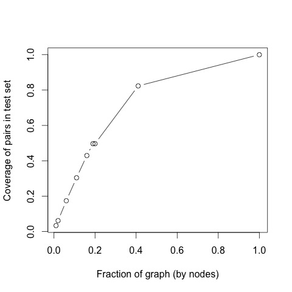
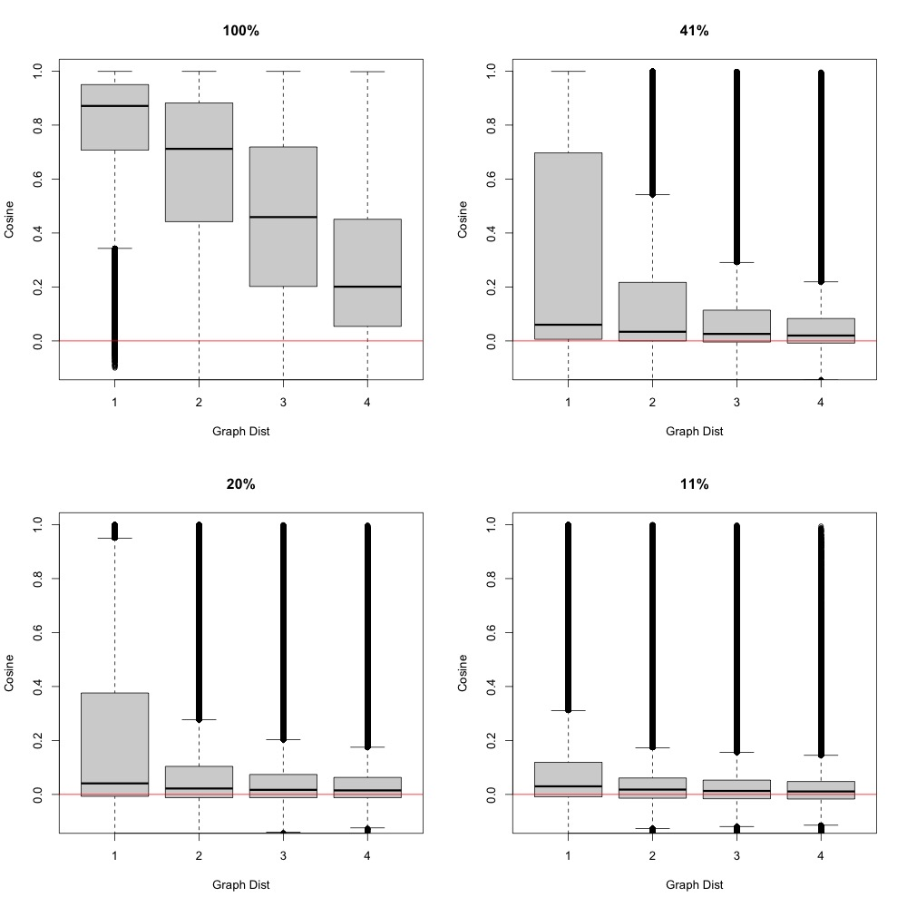

# Measurements of ProNE: Space, Time and Loss

<b>Bottom line</b>: We believe we are on track to compute what we hoped to compute within the time constraints of JSALT-2023.

<h2>ProNE: G -> E</h2>

<a href="https://www.ijcai.org/proceedings/2019/0594.pdf">ProNE</a>
takes a citation graph, G, as input and outputs an Embedding, E.  E is
about 200x larger than G.  The crux of ProNE is an SVD step (line 119
of <a
href="https://github.com/VHRanger/nodevectors/blob/master/nodevectors/prone.py">prone.py</a>)
that inputs G (a sparse graph) and outputs the U (a dense matrix).
The final output embedding, E, is the same size at the U matrix from the SVD.

Even though E is much larger than G, E is more convenient than G for certain
purposes such as making recommendations with Approximate Nearest Neighbors (ANN).

The
citation graph, G, is stored as an adjacency matrix.  That is, G is an
N by N matrix with a 1 in G[i,j] if the i-th paper cites the j-th
paper.  These are stored as compressed files with <a
href="https://docs.scipy.org/doc/scipy/reference/generated/scipy.sparse.save_npz.html">scipy.sparse.save_npz</a>.
This format uses remarkably little space on disk (less than 10 GBs).

Unfortunately, it takes a long time (and a lot of temporary space) to load
and save sparse graphs with scipy.sparse.load_npz and scipy.sparse.save_npz; see <a href="https://github.com/kwchurch/JSALT_Better_Together/blob/main/src/JSALT_util.py">here</a> for an alternative that uses more space on disk, but loads faster with less temp space.

<h2>Scale: More is more</h2>

Why do we believe it is important to study large graphs?
The plot below shows that it is easier to see relationships in larger graphs between distances in citation graphs and cosines in embeddings.

We split the 200M corpus ids in Semantic Scholar into 100 bins with 2M ids in each bin.  The spit was done by time.

The plots below are based on random walks on the full graph.  We randomly picked a corpus id.  From there, we randomly picked a reference,
and repeated the process.  We ended up with a test set of pairs with distances ranging from 1 to 4:

<table>
<tr><th>Graph Distance</th> <th>Pairs</th></tr>
<tr><td>1</td> <td>1062523</td></tr>
<tr><td>2</td>    <td> 1010251</td></tr>
<tr><td>3</td>     <td>  847638</td> </tr>
<tr><td>4 </td>   <td>  550542 </td> </tr>
</table>

The plots below show that it is easier to see relationships in larger graphs between distances in citation graphs and cosines in embeddings.
But before going there, the following plot shows that coverage of test set increases with the size of the graph.  The plots below do not include
pairs in the test set that are not covered.

The plot below is similar to the plot above, but with more resolution over graph sizes.

<h2>Constraints: Jobs should finish in 24 hours (or less) and Consume 3 TBs (or less)</h2>

On the Northeastern Discovery Cluster, users are encouraged to use the
<a
href="https://rc-docs.northeastern.edu/en/latest/hardware/partitions.html">general
access partitions</a>.
On these partitions, jobs are not allowed to
run for more than 24 hours.  One member of our team has access to the long queue, so he can run jobs for up to 5 days.

As for memory, jobs can request up to 3TBs of RAM, but
the more they request, the longer it takes to schedule the job.
For these reasons, it is important to predict how much time and space these jobs will require.

<h2>Splitting ProNE into Many Separate SLURM Jobs</h2>

We started with <a
href="https://github.com/VHRanger/nodevectors/blob/master/nodevectors/prone.py">this version of prone.py</a>,
but split that code into three steps:
<ol>
<li>Prefactorization: <a href="https://github.com/kwchurch/JSALT_Better_Together/blob/main/src/prefactor_graph.py">$JSALTsrc/prefactor_graph.py</a></li>
<li>Chebyshev Iterations (10-14 steps): <a href="https://github.com/kwchurch/JSALT_Better_Together/blob/main/src/ProNE_chebyshev.py">$JSALTsrc/ProNE_chebyshev.py</a></li>
<li>Finish: <a href="https://github.com/kwchurch/JSALT_Better_Together/blob/main/src/ProNE_finish.py">$JSALTsrc/ProNE_finish.py</a></li>
</ol>

The purpose of splitting the job into three steps is to make it easier to restart jobs,
and to study space, time and loss.   After splitting into lots of smaller jobs, the smaller
jobs are less likely to run into the constraints mentioned above.

<ol>
<li>Where are the bottlenecks?</li>
<li>How does space and time increase with the size of G?  <a href="https://app.globus.org/file-manager?origin_id=1ef9019c-eac0-11ed-9ba9-c9bb788c490e&origin_path=%2F~%2Fsemantic_scholar%2Fembeddings%2Fproposed%2F">These ProNE embeddings</a>
were computed using <a
href="https://github.com/VHRanger/nodevectors/blob/master/nodevectors/prone.py">this version of prone.py</a>,
but it took nearly 5 days to compute.  As G becomes larger, the time will surely increase.  Is it possible
to compute M using <a
href="https://rc-docs.northeastern.edu/en/latest/hardware/partitions.html">general
access partitions</a>?  Is we cannot do that for the entire graph, can we cut G into a few subgraphs,
and compute M for each subgraph?
<li>How does loss depend on the number of Chebyshev iterations?  How many iterations do we need?</li>
</ol>

After spliting the job into three steps, it coems clear that the
bottleneck (for both space and time) is the call to SVD in the first step (prefactorization).
The charts below are based on 100 citation graphs (split by time).
The 200M papers in Semanatic Scholar were split into bins with about 2M papers
per bin.  Each subsgraph includes all of the previous subgraphs.
The jobs run quickly on the smaller graphs.  Based on those, we estimate how
much time and space will be required to compute the largest graph (piece 99).

The plots below show:
<ol>
<li>Prefactorization of piece 99: 2.6 days with 1.3 TBs of memory. Memory grows linearly with piece, and time grows quadratically with piece.
The first 50 pieces can be computed 
<a
href="https://rc-docs.northeastern.edu/en/latest/hardware/partitions.html">general
access partitions</a>.  After that, we need to use the long partition, unless we can find a way to speed up the SVD (which we are working on).</li>
<li>Chebyshev iterations are easier.  For piece 99, each iteration takes 1.69 hours, and 532 GBs of memory.</li>
<li>The Finish step includes another SVD.  It will take about 6 hours and 1 TB of memory for piece 99.</li>
</ol>

Bottom line: We will be able to compute M for all 100 pieces (G) during JSALT.  Prefactorization for pieces 51-99 will require the long
queue, but the rest of the computation can be done on
<a
href="https://rc-docs.northeastern.edu/en/latest/hardware/partitions.html">general
access partitions</a>

<h3>Prefactorization will require 2.6 days and 1.3 TBs for piece 99</h3>

Quadratic time may be unavoidable, given that edges are growing faster than nodes.  The quadratic time also casts
doubt on attempts to approximate embeddings with a linear time updating method (such as the standard recipe for training deep nets).

We plan to work on methods to incrementally update embeddings as new papers are added to the graph.
Unfortunately, the quadratic time suggests that incremental update methods will inevitably introduce losses.  

<h3>Each Chebyshev iteration will require 1.69 hours and 532 GBs for piece 99</h3>

<h3>The Finish step will take about 6 hours and 1 TB of memory for piece 99</h3>

