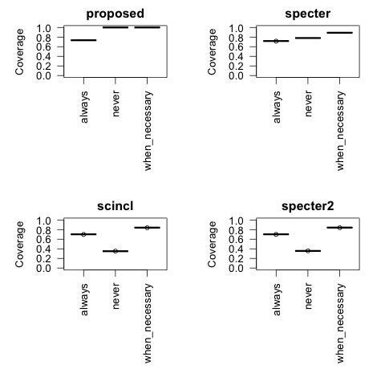

# Measurements by Embedding

We will consider three methods to compute vectors: f, fhat and ensemble.  The three cases are expressed by
the use_references argument to various programs.  This argument is never (for f), always (for fhat)
and when necessary (for ensemble).

<ol>
<li><b>f</b> (never): use ProNE vectors for the two input corpus ids</li>
<li><b>fhat</b> (always): use the centroid approximation to estiamte vectors for the two input corpus ids</li>
<li><b>ensemble</b> (when necessary): use f when it is available, and otherwise use fhat</li>
</ol>

The centroid approximation is: fhat(d) = sum f(r), where r is a reference of d.

In other words, we estimate the vector for document d from its references, r.

<h2>Materials</h2>

See walk_with_bins on <a href="https://app.globus.org/file-manager?origin_id=1ef9019c-eac0-11ed-9ba9-c9bb788c490e&origin_path=%2F~%2Fsemantic_scholar%2Feval%2F">Globus</a>.  If you have access to the Northeastern cluster, see $JSALTdir/semantic_scholar/eval/walk_with_bins.
There are splits of this data: walk.??.  Each of these splits is about 50k lines.  The first column is a distance
on the graph followed by two corpus ids (and their bins).

Link Prediction Task: input a pair of corpus ids and output 0 or 1 (either the first paper references the second, or not).  That is, the distance
is either 1 or more than 1.  The negatives are harder than random since all of these pairs are near one another in the graph.

Train on some bins,
and test on others.  We hope to show that short-term forecasting is easier than long-term forecasting.
That is, performance should decrease when there is a large gap between the bins for training and the bins for testing.

<h2>Results: Coverage</h2>

Observations:
<li>

<h2>Results: Link Prediction</h2>

<i>to be done</i>