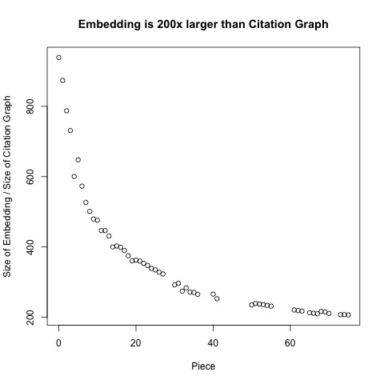
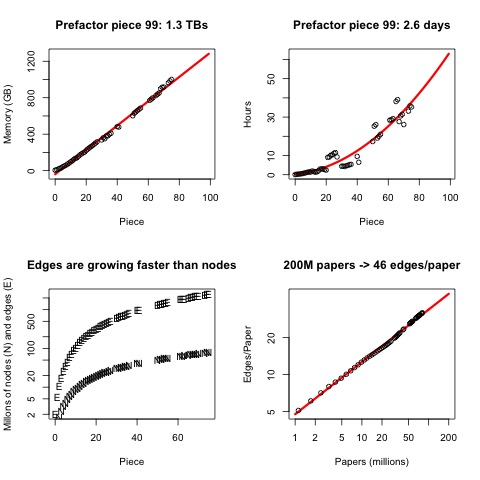

# Measurements of Prefactorization Time and Space

ProNE takes a citation graph as input and outputs an Embedding.  The
citation graph, G, is stored as an adjacency matrix.  That is, G is an
N by N matrix with a 1 in G[i,j] if the i-th paper cites the j-th
paper.  These are stored as compressed files with <a
href="https://docs.scipy.org/doc/scipy/reference/generated/scipy.sparse.save_npz.html">scipy.sparse.save_npz</a>.
This format uses remarkably little space on disk, but it takes a long
time (and quite a bit of temp space) to load it into python.  (See <a href="https://github.com/kwchurch/JSALT_Better_Together/blob/main/src/JSALT_util.py">here</a> for an alternative that uses more space on disk, but loads faster with less temp space).

Our ProNE implementation consists of three steps:
<ol>
<li>Prefactorization: $JSALTsrc/prefactor_graph.py</li>
<li>Chebyshev Iterations (10 steps): $JSALTsrc/ProNE_chebyshev.py</li>
<li>Finish: ProNE_finish.py</li>
</ol>

We believe the bulk of the time is in the first step (prefactorization),
and the bulk of the space is in the Chebyshev iterations.

