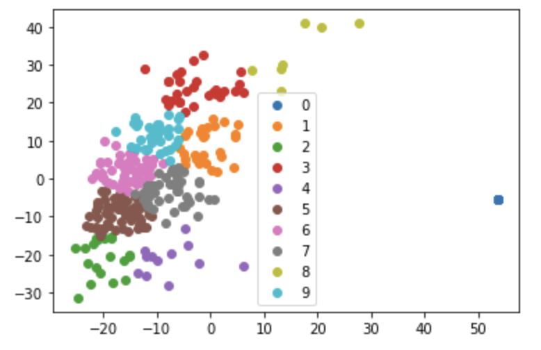
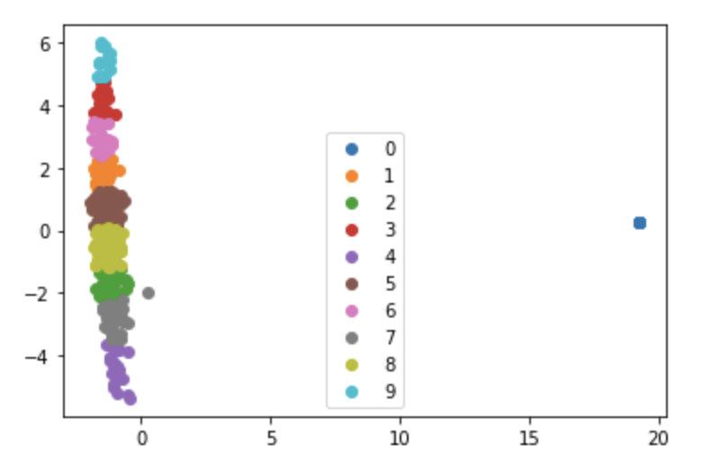
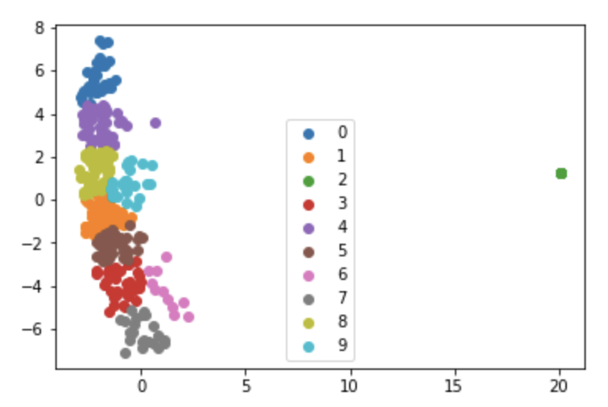
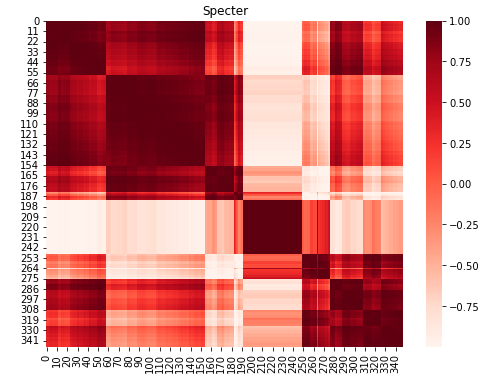
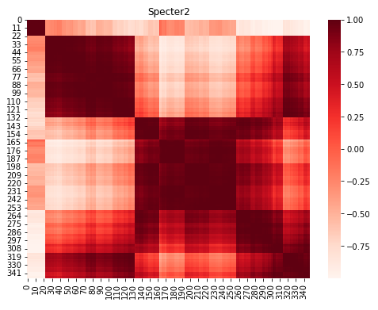
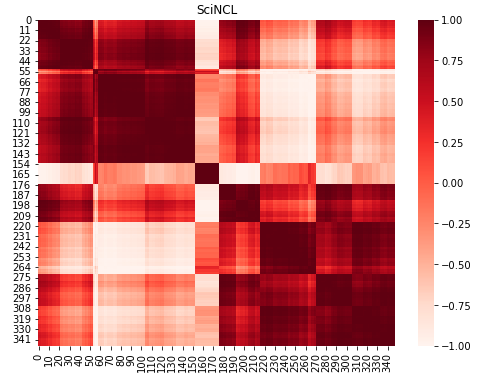
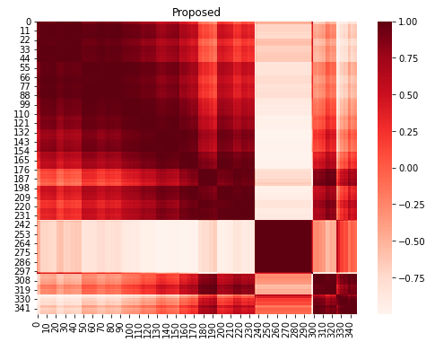

<h1 style="text-align: center;">Paper Collection Analysis and Visualization</h1>

<h3 style="text-align: center;">Motivation</h3>

Given a large number of documents on a topic, how do we get a sense of what the documents are about and which ones to read carefully? What topics are represented within the collection?

This tool helps address the above questions by clustering documents using their embeddings, **summarizing** the resulting clusters using the closest paper to each centroid, and providing a **full list of papers** associated with each cluster. Additionally, the **heat map visualizations** show the similarity of each document with all other documents within an embedding and overall similarity across embedding types.

<h3 style="text-align: center;">K-means Clustering Visualizations</h3>

The following visualizations show the clusters of documents for each of the included embeddings after performing k-means clustering.

 

<h3 style="text-align: center;">Cluster Summaries</h3>
This table shows the 10 clusters sorted using optimal leaf ordering of the centroids. The links in the first column display the full set of papers in the clusters.
<html><table><tr>
<th>Cluster</th>
<th># Papers</th>
<th>Paper</th>
<th>Summary</th> 
</tr>
<tr>
<td><a href="clusters/cluster1.md">C1</a></td>
<td>45</td>
<td><a href="https://www.semanticscholar.org/paper/05fe77337bb43d4efd2c042c9bd5f044bb6e2271">NeuS: Neutral Multi-News Summarization for Mitigating Framing Bias</a></td>
<td>This paper proposes a new task, a neutral summary generation from multiple news articles of the varying political leaning to facilitate balanced and unbiased news reading, and presents NeuS-Title that learns to neutralize news content in hierarchical order from title to article.</td>
</tr>
<tr>
<td><a href="clusters/cluster2.md">C2</a></td>
<td>61</td>
<td><a href="https://www.semanticscholar.org/paper/0abcbdf40f872e6baf1c082811d4ae93df787698">Are We Modeling the Task or the Annotator? An Investigation of Annotator Bias in Natural Language Understanding Datasets</a></td>
<td>It is shown that model performance improves when training with annotator identifiers as features, and that models are able to recognize the most productive annotators and that often models do not generalize well to examples from annotators that did not contribute to the training set.</td>
</tr>
<tr>
<td><a href="clusters/cluster3.md">C3</a></td>
<td>51</td>
<td><a href="https://www.semanticscholar.org/paper/f5cf4eafd824d680bbfdcec572826bcf7d0c6d7a">Book Review: Close Engagements with Artificial Companions: Key Social, Psychological, Ethical, and Design Issues edited by Yorick Wilks</a></td>
<td>This book is an edited collection of chapters on artificial companions that purports to discuss the philosophical and ethical issues associated with ACs, what ACs should be like and how to construct them, and to provide examples of special-purpose ACs.</td>
</tr>
<tr>
<td><a href="clusters/cluster4.md">C4</a></td>
<td>60</td>
<td><a href="https://www.semanticscholar.org/paper/401915f35c3ca6b7f50d09c14007043775216cb9">Ethics Sheet for Automatic Emotion Recognition and Sentiment Analysis</a></td>
<td>This ethics sheet fleshes out assumptions hidden in how AER is commonly framed, and in the choices often made regarding the data, method, and evaluation, to facilitate and encourage more thoughtfulness on why to automate, how to automation, and how to judge success well before the building of AER systems.</td>
</tr>
<tr>
<td><a href="clusters/cluster5.md">C5</a></td>
<td>23</td>
<td><a href="https://www.semanticscholar.org/paper/cc70ec5aa10ff158f7e9950ec38d65d6eb4a8ff3">Hell Hath No Fury? Correcting Bias in the NRC Emotion Lexicon</a></td>
<td>A procedure for semi-automatically correcting problems in the NRC lexicon is described, which includes disambiguating POS categories and aligning NRC entries with other emotion lexicons to infer the accuracy of labels.</td>
</tr>
<tr>
<td><a href="clusters/cluster6.md">C6</a></td>
<td>13</td>
<td><a href="https://www.semanticscholar.org/paper/f8a13e94260373d2904f32616decce817b388990">Equity Beyond Bias in Language Technologies for Education</a></td>
<td>Concepts from culturally relevant pedagogy and other frameworks for teaching and learning are introduced, identifying future work on equity in NLP.</td>
</tr>
<tr>
<td><a href="clusters/cluster7.md">C7</a></td>
<td>16</td>
<td><a href="https://www.semanticscholar.org/paper/cfe5bde939013d94286b7d21e502b5ee7c442450">On the Ethical Considerations of Text Simplification</a></td>
<td>None</td>
</tr>
<tr>
<td><a href="clusters/cluster8.md">C8</a></td>
<td>14</td>
<td><a href="https://www.semanticscholar.org/paper/9a33f92315803d5f280eff026746f1665777a28f">LOGAN: Local Group Bias Detection by Clustering</a></td>
<td>LOGAN, a new bias detection technique based on clustering, is proposed and experiments show that LOGAN identifies bias in a local region and allows us to better analyze the biases in model predictions.</td>
</tr>
<tr>
<td><a href="clusters/cluster9.md">C9</a></td>
<td>60</td>
<td><a href="https://www.semanticscholar.org/paper/f29d5cb8f405903fc8af7a5d7ab4bf7d65796e95">Use of Formal Ethical Reviews in NLP Literature: Historical Trends and Current Practices</a></td>
<td>A detailed quantitative and qualitative analysis of the ACL Anthology is conducted, as well as comparing the trends in the field to those of other related disciplines, such as cognitive science, machine learning, data mining, and systems.</td>
</tr>
<tr>
<td><a href="clusters/cluster10.md">C10</a></td>
<td>5</td>
<td><a href="https://www.semanticscholar.org/paper/e9d87b6ffdcc812707ab1721a677fd6ce4c7d9c2">Enhancing Bias Detection in Political News Using Pragmatic Presupposition</a></td>
<td>This paper proposes a set of guidelines to identify various kinds of presuppositions in news articles and presents a dataset consisting of 1050 articles which are annotated for bias (positive, negative or neutral) and the magnitude of presupposition.</td>
</tr>
</table></html>

<h3 style="text-align: center;">Hierarchical Clustering Visualizations</h3>
The following visualizations show the cosine similarity of the papers for each embedding after performing hierarchical clustering. The rows and columns are permuted based on optimal leaf ordering.

 

