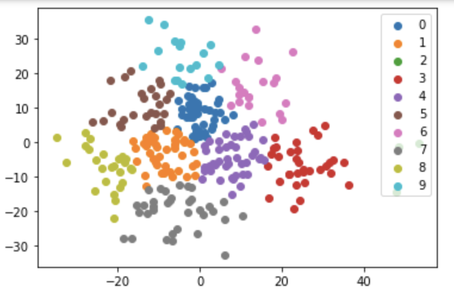
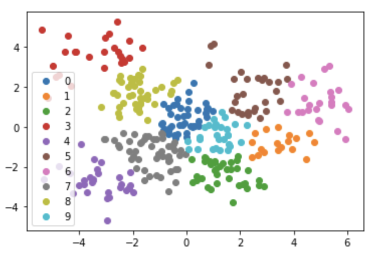
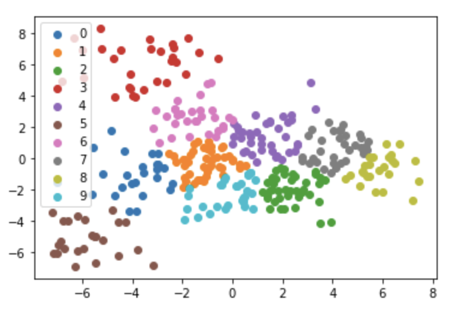
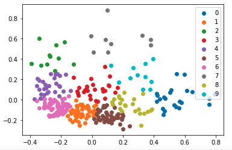
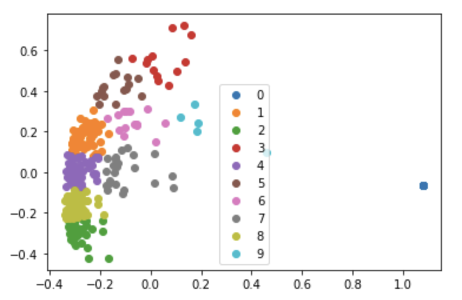
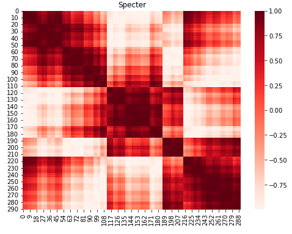
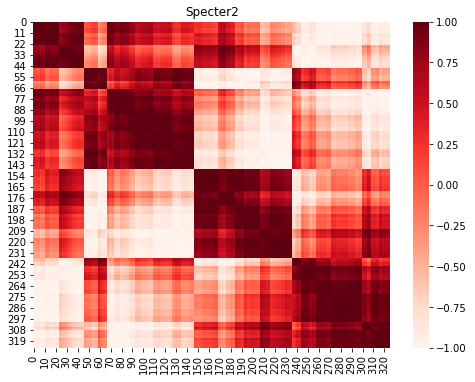
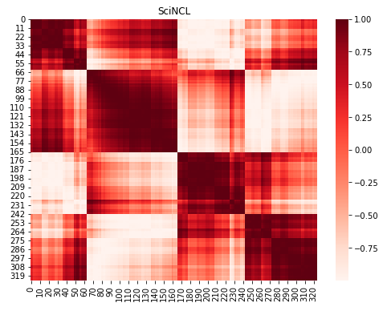
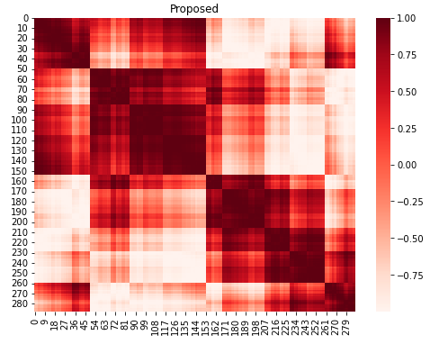

<h1 style="text-align: center;">Paper Collection Analysis and Visualization</h1>

<h3 style="text-align: center;">Motivation</h3>

Given a large number of documents on a topic, how do we get a sense of what the documents are about and which ones to read carefully? What topics are represented within the collection?

This tool helps address the above questions by clustering documents using their embeddings, **summarizing** the resulting clusters using the closest paper to each centroid, and providing a **full list of papers** associated with each cluster. Additionally, the **heat map visualizations** show the similarity of each document with all other documents within an embedding and overall similarity across embedding types.

<h3 style="text-align: center;">K-means Clustering Visualizations</h3>

The following visualizations show the clusters of documents for each of the included embeddings after performing k-means clustering.

Excluding papers not found on Semantic Scholar:

Including papers not found on Semantic Scholar:

 

<h3 style="text-align: center;">Cluster Summaries</h3>
This table shows the 10 clusters sorted using optimal leaf ordering of the centroids. The links in the first column display the full set of papers in the clusters.

Excluding papers not found on Semantic Scholar:
<html><table><tr>
<th>Cluster</th>
<th># Papers</th>
<th>Paper</th>
<th>Summary</th> 
</tr>
<tr>
<td><a href="clusters/cluster1.md">C1</a></td>
<td>23</td>
<td><a href=https://www.semanticscholar.org/paper/a8026ad09d1b31987b66ecd35efbb72676fb9cb4>Artie Bias Corpus: An Open Dataset for Detecting Demographic Bias in Speech Applications</a></td>
<td>A significant accent bias is observed in the baseline DeepSpeech model, with more accurate transcriptions of US English compared to Indian English, and the criteria used to select and annotate the Artie Bias Corpus is described.</td>
</tr>
<tr>
<td><a href="clusters/cluster2.md">C2</a></td>
<td>11</td>
<td><a href=https://www.semanticscholar.org/paper/ce6945d32780c599d829c1995dfc1555ab33bdd1>We Can Detect Your Bias: Predicting the Political Ideology of News Articles</a></td>
<td>A large dataset of articles that were manually annotated for political ideology -left, center, or right-, which is well-balanced across both topics and media, and an adversarial media adaptation, as well as a specially adapted triplet loss are proposed.</td>
</tr>
<tr>
<td><a href="clusters/cluster3.md">C3</a></td>
<td>44</td>
<td><a href=https://www.semanticscholar.org/paper/7328ee1811b8a5fca1df70f84e1f82deb0def285>Second Order WinoBias (SoWinoBias) Test Set for Latent Gender Bias Detection in Coreference Resolution</a></td>
<td>This work observes an instance of gender-induced bias in a downstream application, despite the absence of explicit gender words in the test cases, and evaluates the performance of current debiasing methods on the SoWinoBias test set.</td>
</tr>
<tr>
<td><a href="clusters/cluster4.md">C4</a></td>
<td>59</td>
<td><a href=https://www.semanticscholar.org/paper/d99812eae25c17e045d02c2b3906ac121ab25c86>CLARIN: Towards FAIR and Responsible Data Science Using Language Resources</a></td>
<td>How the design and implementation of CLARIN are compliant with the FAIR principles: findability, accessibility, interoperability and reusability of data is explained.</td>
</tr>
<tr>
<td><a href="clusters/cluster5.md">C5</a></td>
<td>30</td>
<td><a href=https://www.semanticscholar.org/paper/5a0b974dc9eaa6633808a0f6699592ee5254ac20>Analysis of Gender Bias in Social Perception and Judgement Using Chinese Word Embeddings</a></td>
<td>None</td>
</tr>
<tr>
<td><a href="clusters/cluster6.md">C6</a></td>
<td>51</td>
<td><a href=https://www.semanticscholar.org/paper/d3fec2b47051ab07e43af6462c62566e053df033>Not All Reviews Are Equal: Towards Addressing Reviewer Biases for Opinion Summarization</a></td>
<td>This work proposes to model reviewer biases from their review texts and rating distributions, and learns a bias-aware opinion representation, and devise an approach for balanced opinion summarization of reviews using the bias- aware opinion representation.</td>
</tr>
<tr>
<td><a href="clusters/cluster7.md">C7</a></td>
<td>10</td>
<td><a href=https://www.semanticscholar.org/paper/0ee4aad344e03ba68267199652946d1260b0fd93>Ethical Considerations in NLP Shared Tasks</a></td>
<td>A number of ethical issues along with other areas of concern that are related to the competitive nature of shared tasks are presented and the development of a framework for the organisation of and participation in shared tasks that can help mitigate against these issues arising are proposed.</td>
</tr>
<tr>
<td><a href="clusters/cluster8.md">C8</a></td>
<td>14</td>
<td><a href=https://www.semanticscholar.org/paper/7dc43f7339e636ba49891732e3f20b3b377dfd78>Decoupling Adversarial Training for Fair NLP</a></td>
<td>This paper proposes a training strategy which needs only a small volume of protected labels in adversarial training, incorporating an estimation method to transfer private-labelled instances from one dataset to another.</td>
</tr>
<tr>
<td><a href="clusters/cluster9.md">C9</a></td>
<td>27</td>
<td><a href=https://www.semanticscholar.org/paper/39d84b48cbc6f57019a01a4644a5377dc19bd852>Modeling Users and Online Communities for Abuse Detection: A Position on Ethics and Explainability</a></td>
<td>The role that modeling of users and online communities plays in abuse detection is discussed, and state of the art methods that leverage user or community information to enhance the understanding and detection of abusive language are reviewed.</td>
</tr>
<tr>
<td><a href="clusters/cluster10.md">C10</a></td>
<td>11</td>
<td><a href=https://www.semanticscholar.org/paper/b6ffd8ed6a0d35bce6339492fb0e776fe75a04c8>Lipstick on a Pig: Debiasing Methods Cover up Systematic Gender Biases in Word Embeddings But do not Remove Them</a></td>
<td>It is concluded that existing bias removal techniques are insufficient, and should not be trusted for providing gender-neutral modeling, for two debiasing methods.</td>
</tr>
</table></html>

Including papers not found on Semantic Scholar:
<html><table><tr>
<th>Cluster</th>
<th># Papers</th>
<th>Paper</th>
<th>Summary</th> 
</tr>
<tr>
<td><a href="clusters/cluster1.md">C1</a></td>
<td>45</td>
<td><a href="https://www.semanticscholar.org/paper/05fe77337bb43d4efd2c042c9bd5f044bb6e2271">NeuS: Neutral Multi-News Summarization for Mitigating Framing Bias</a></td>
<td>This paper proposes a new task, a neutral summary generation from multiple news articles of the varying political leaning to facilitate balanced and unbiased news reading, and presents NeuS-Title that learns to neutralize news content in hierarchical order from title to article.</td>
</tr>
<tr>
<td><a href="clusters/cluster2.md">C2</a></td>
<td>61</td>
<td><a href="https://www.semanticscholar.org/paper/0abcbdf40f872e6baf1c082811d4ae93df787698">Are We Modeling the Task or the Annotator? An Investigation of Annotator Bias in Natural Language Understanding Datasets</a></td>
<td>It is shown that model performance improves when training with annotator identifiers as features, and that models are able to recognize the most productive annotators and that often models do not generalize well to examples from annotators that did not contribute to the training set.</td>
</tr>
<tr>
<td><a href="clusters/cluster3.md">C3</a></td>
<td>51</td>
<td><a href="https://www.semanticscholar.org/paper/f5cf4eafd824d680bbfdcec572826bcf7d0c6d7a">Book Review: Close Engagements with Artificial Companions: Key Social, Psychological, Ethical, and Design Issues edited by Yorick Wilks</a></td>
<td>This book is an edited collection of chapters on artificial companions that purports to discuss the philosophical and ethical issues associated with ACs, what ACs should be like and how to construct them, and to provide examples of special-purpose ACs.</td>
</tr>
<tr>
<td><a href="clusters/cluster4.md">C4</a></td>
<td>60</td>
<td><a href="https://www.semanticscholar.org/paper/401915f35c3ca6b7f50d09c14007043775216cb9">Ethics Sheet for Automatic Emotion Recognition and Sentiment Analysis</a></td>
<td>This ethics sheet fleshes out assumptions hidden in how AER is commonly framed, and in the choices often made regarding the data, method, and evaluation, to facilitate and encourage more thoughtfulness on why to automate, how to automation, and how to judge success well before the building of AER systems.</td>
</tr>
<tr>
<td><a href="clusters/cluster5.md">C5</a></td>
<td>23</td>
<td><a href="https://www.semanticscholar.org/paper/cc70ec5aa10ff158f7e9950ec38d65d6eb4a8ff3">Hell Hath No Fury? Correcting Bias in the NRC Emotion Lexicon</a></td>
<td>A procedure for semi-automatically correcting problems in the NRC lexicon is described, which includes disambiguating POS categories and aligning NRC entries with other emotion lexicons to infer the accuracy of labels.</td>
</tr>
<tr>
<td><a href="clusters/cluster6.md">C6</a></td>
<td>13</td>
<td><a href="https://www.semanticscholar.org/paper/f8a13e94260373d2904f32616decce817b388990">Equity Beyond Bias in Language Technologies for Education</a></td>
<td>Concepts from culturally relevant pedagogy and other frameworks for teaching and learning are introduced, identifying future work on equity in NLP.</td>
</tr>
<tr>
<td><a href="clusters/cluster7.md">C7</a></td>
<td>16</td>
<td><a href="https://www.semanticscholar.org/paper/cfe5bde939013d94286b7d21e502b5ee7c442450">On the Ethical Considerations of Text Simplification</a></td>
<td>None</td>
</tr>
<tr>
<td><a href="clusters/cluster8.md">C8</a></td>
<td>14</td>
<td><a href="https://www.semanticscholar.org/paper/9a33f92315803d5f280eff026746f1665777a28f">LOGAN: Local Group Bias Detection by Clustering</a></td>
<td>LOGAN, a new bias detection technique based on clustering, is proposed and experiments show that LOGAN identifies bias in a local region and allows us to better analyze the biases in model predictions.</td>
</tr>
<tr>
<td><a href="clusters/cluster9.md">C9</a></td>
<td>60</td>
<td><a href="https://www.semanticscholar.org/paper/f29d5cb8f405903fc8af7a5d7ab4bf7d65796e95">Use of Formal Ethical Reviews in NLP Literature: Historical Trends and Current Practices</a></td>
<td>A detailed quantitative and qualitative analysis of the ACL Anthology is conducted, as well as comparing the trends in the field to those of other related disciplines, such as cognitive science, machine learning, data mining, and systems.</td>
</tr>
<tr>
<td><a href="clusters/cluster10.md">C10</a></td>
<td>5</td>
<td><a href="https://www.semanticscholar.org/paper/e9d87b6ffdcc812707ab1721a677fd6ce4c7d9c2">Enhancing Bias Detection in Political News Using Pragmatic Presupposition</a></td>
<td>This paper proposes a set of guidelines to identify various kinds of presuppositions in news articles and presents a dataset consisting of 1050 articles which are annotated for bias (positive, negative or neutral) and the magnitude of presupposition.</td>
</tr>
</table></html>

<h3 style="text-align: center;">Hierarchical Clustering Visualizations</h3>
The following visualizations show the cosine similarity of the papers for each embedding after performing hierarchical clustering. The rows and columns are permuted based on optimal leaf ordering.
Excluding papers not found on Semantic Scholar:

 

Including papers not found on Semantic Scholar:

 

