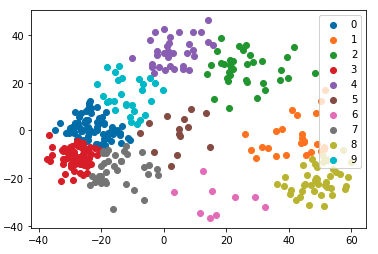
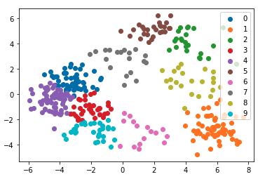
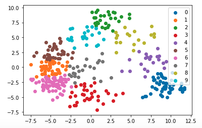
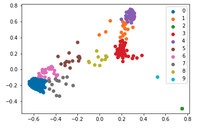
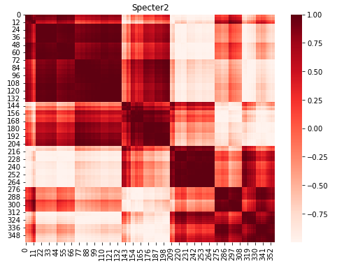
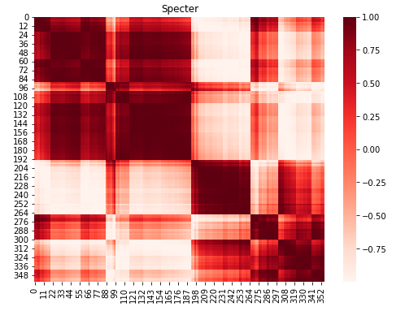
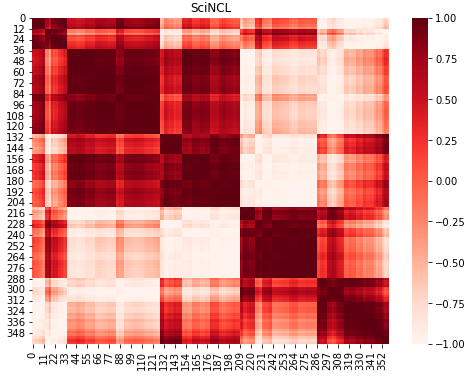
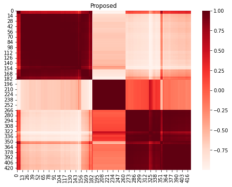

<h1 style="text-align: center;">Paper Collection Analysis and Visualization</h1>

<h3 style="text-align: center;">Motivation</h3>

Given a large number of documents on a topic, how do we get a sense of what the documents are about and which ones to read carefully? What topics are represented within the collection?

This tool helps address the above questions by clustering documents using their embeddings, **summarizing** the resulting clusters using the closest paper to each centroid, and providing a **full list of papers** associated with each cluster. Additionally, the **heat map visualizations** show the similarity of each document with all other documents within an embedding and overall similarity across embedding types.

<h3 style="text-align: center;">K-means Clustering Visualizations</h3>

The following visualizations show the clusters of documents for each of the included embeddings after performing k-means clustering.

 

<h3 style="text-align: center;">Cluster Summaries</h3>

<html><table><tr>
<th>Cluster</th>
<th>Paper</th>
<th>Summary</th> 
</tr>
<tr>
<td><a href="clusters/cluster1.md">C1</a></td>
<td><a href="https://www.semanticscholar.org/paper/d9b4ca3f27e27d36793cf278cc6da37af6825c9f">El uso de las TIC en la EIB como herramienta para la revitalización del quechua</a></td>
<td>None</td>
</tr>

<tr>
<td><a href="clusters/cluster2.md">C2</a></td>
<td><a href="https://www.semanticscholar.org/paper/0045a1225de1538b0f1c52c31d9bfd84ef1a28ee">Automatic Speech Recognition of Quechua Language Using HMM Toolkit</a></td>
<td>The ASR was developed using Hidden Markov Model Toolkit and the corpus collected by Siminchikkunarayku and tested using the audios recorded by volunteers obtaining a 12.70% word error rate.</td>
</tr>

<tr>
<td><a href="clusters/cluster3.md">C3</a></td>
<td><a href="https://www.semanticscholar.org/paper/1a98af3ac4315b9e5103ae54c42e75db8561bb10">Propositional- and illocutionary-level evidentiality in Cuzco Quechua</a></td>
<td>None</td>
</tr>

<tr>
<td><a href="clusters/cluster4.md">C4</a></td>
<td><a href="https://www.semanticscholar.org/paper/f206088d952b44e0c0b32ca82946fc5dce2ab469">COfEE: A Comprehensive Ontology for Event Extraction from text, with an online annotation tool</a></td>
<td>This work proposes an event ontology, namely COfEE, that incorporates both expert domain knowledge, previous ontologies and a data-driven approach for identifying events from text and presents a supervised method based on deep learning techniques to automatically extract relevant events and corresponding actors.</td>
</tr>

<tr>
<td><a href="clusters/cluster5.md">C5</a></td>
<td><a href="https://www.semanticscholar.org/paper/aab5429817233e16fa825eb2a9df81161b07a24d">Role of artificial intelligence and machine learning in haematology</a></td>
<td>This paper will explore how AI could impact three key components of the haematology patient pathway: diagnosis, monitoring and treatment.</td>
</tr>

<tr>
<td><a href="clusters/cluster6.md">C6</a></td>
<td><a href="https://www.semanticscholar.org/paper/e54ffc76d805c48660bb0fd20019ca82ac94ba0d">Intrinsic Dimensionality Explains the Effectiveness of Language Model Fine-Tuning</a></td>
<td>This paper proposes a debiasing method for pre-trained text encoders that both reduces social stereotypes, and inflicts next to no semantic damage, and confirms that reducing bias from attention effectively mitigates it from the model’s text representations.</td>
</tr>
</table></html>

<tr>
<td><a href="clusters/cluster7.md">C7</a></td>
<td><a href="https://www.semanticscholar.org/paper/cea1eb27d7508c21be18a8a0d0e0119da47b608f">AFINES QUECHUA EN EL VOCABULARIO MAPUCHE DE LUIS DE VALDIVIA</a></td>
<td>None</td>
</tr>

<tr>
<td><a href="clusters/cluster8.md">C8</a></td>
<td><a href="https://www.semanticscholar.org/paper/d04cd77be519dc58250acc09b70e4442127318cb">CERVICAL LESION DETECTION USING VISUAL INSPECTION WITH ACETIC ACID AND ASSOCIATED FACTORS AMONG ETHIOPIAN WOMEN</a></td>
<td>The observed high prevalence of VIA positive result in the study shows the need for strengthening cervical cancer prevention strategies in theStudy area and should consider other settings and better diagnostic tools.</td>
</tr>

<tr>
<td><a href="clusters/cluster9.md">C9</a></td>
<td><a href="https://www.semanticscholar.org/paper/7b8d0413ee38d09421e0243dbb63c1e51fd1b571">Low-Resource Language Modelling of South African Languages</a></td>
<td>Evaluating the performance of open-vocabulary language models on lowresource South African languages, using bytepair encoding to handle the rich morphology of these languages finds well-regularized RNNs give the best performance across two isiZulu and one Sepedi datasets.</td>
</tr>

<tr>
<td><a href="clusters/cluster10.md">C10</a></td>
<td><a href="https://www.semanticscholar.org/paper/2843f3a14a142637fe65ce2bb7d7193e7806fbcd">UZH TILT: A Kaldi recipe for Swiss German Speech to Standard German Text</a></td>
<td>This paper describes a proposed system that makes use of the Kaldi Speech Recognition Toolkit to implement a time delay neural network (TDNN) Acoustic Model (AM) with an extended pronunciation lexicon and language model to translate spoken Swiss German into standard German text implicitly through STT.</td>
</tr>

<h3 style="text-align: center;">Hierarchical Clustering Visualizations</h3>
The following visualizations show the cosine similarity of the papers for each embedding after performing hierarchical clustering. The rows and columns are permuted based on optimal leaf ordering.

 

