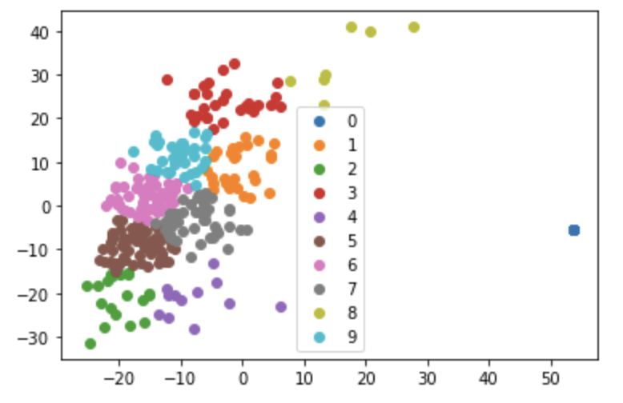
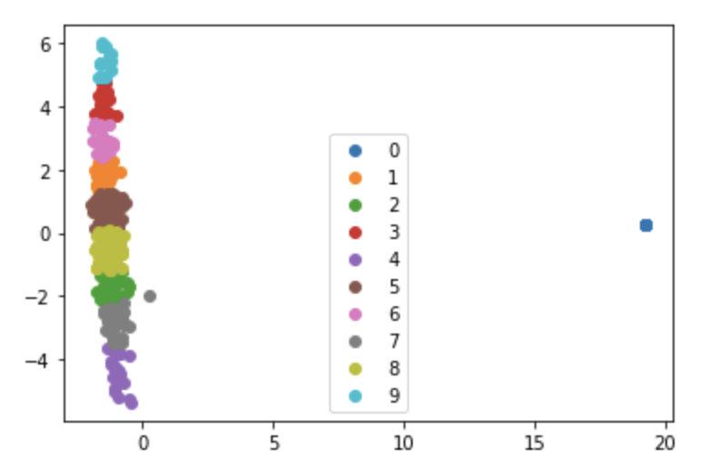
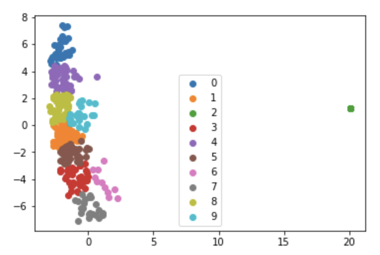
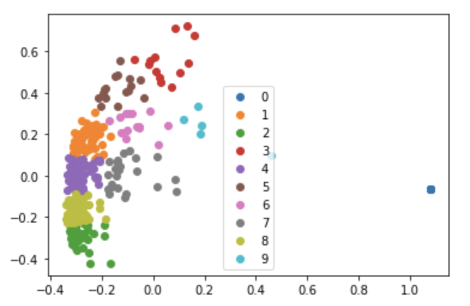
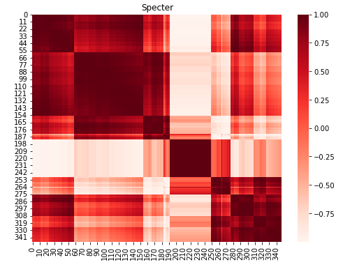
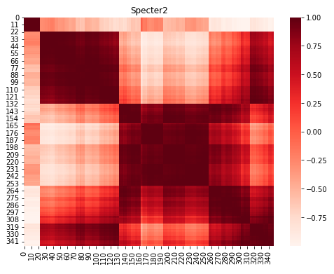
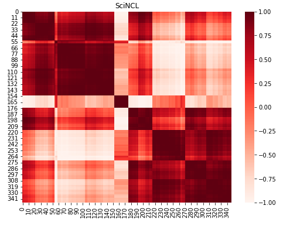
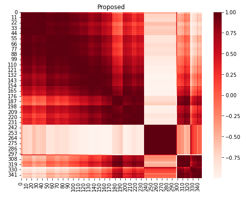

<h1 style="text-align: center;">Paper Collection Analysis and Visualization</h1>

<h3 style="text-align: center;">Motivation</h3>

Given a large number of documents on a topic, how do we get a sense of what the documents are about and which ones to read carefully? What topics are represented within the collection?

This tool helps address the above questions by clustering documents using their embeddings, **summarizing** the resulting clusters using the closest paper to each centroid, and providing a **full list of papers** associated with each cluster. Additionally, the **heat map visualizations** show the similarity of each document with all other documents within an embedding and overall similarity across embedding types.

<h3 style="text-align: center;">K-means Clustering Visualizations</h3>

The following visualizations show the clusters of documents for each of the included embeddings after performing k-means clustering.

 

<h3 style="text-align: center;">Cluster Summaries</h3>

<html><table><tr>
<th>Cluster</th>
<th>Paper</th>
<th>Summary</th> 
</tr>
<tr>
<td><a href="clusters/cluster1.md">C1</a></td>
<td><a href="https://www.semanticscholar.org/paper/d6ddc4f4c81c9565019be1983d37f9fbdf5bd057">The Birth of Bias: A case study on the evolution of gender bias in an English language model</a></td>
<td>It is found that the representation of gender is dynamic and identify different phases during training, and it is shown that gender information is represented increasingly locally in the input embeddings of the model and that debiasing these can be effective in reducing the downstream bias.</a></td>
</tr>
<tr>
<td><a href="clusters/cluster2.md">C2</a></td>
<td><a href="https://www.semanticscholar.org/paper/8700ebd18e6f9726717ecb57dcc9503dfd50306b">The Multilingual Affective Soccer Corpus (MASC): Compiling a biased parallel corpus on soccer reportage in English, German and Dutch</a></td>
<td>The Multilingual Affective Soccer Corpus is a collection of soccer match reports in English, German and Dutch with the aim of investigating the role of affect in sports reportage in different languages and cultures.</a></td>
</tr>
<tr>
<td><a href="clusters/cluster3.md">C3</a></td>
<td><a href="https://www.semanticscholar.org/paper/1fbb406a7387451bb1b6b67a44975c65120ad03a">Debiasing Pretrained Text Encoders by Paying Attention to Paying Attention</a></td>
<td>This paper proposes a debiasing method for pre-trained text encoders that both reduces social stereotypes, and inflicts next to no semantic damage, and confirms that reducing bias from attention effectively mitigates it from the model’s text representations.</a></td>
</tr>
<tr>
<td><a href="clusters/cluster4.md">C4</a></td>
<td><a href="https://www.semanticscholar.org/paper/dcb0b23685c9c116d8d53fe47e5157753659d3bd">Towards Argument Mining for Social Good: A Survey</a></td>
<td>This survey builds an interdisciplinary picture of Argument Mining, with a strong focus on its potential to address issues related to Social and Political Science, and proposes a novel definition of argument quality which is integrated with that of deliberative quality from the Social Science literature.</a></td>
</tr>
<tr>
<td><a href="clusters/cluster5.md">C5</a></td>
<td><a href="https://www.semanticscholar.org/paper/2775900e7633f218618f9f7ca5cfda984fae323d">Debiasing Neural Retrieval via In-batch Balancing Regularization</a></td>
<td>This work develops a differentiable {textbf{normed Pairwise Ranking Fairness} (nPRF) and leverage the T-statistics on top of nPRF over subgroups as a regularization to improve fairness.</a></td>
</tr>
<tr>
<td><a href="clusters/cluster6.md">C6</a></td>
<td><a href="https://www.semanticscholar.org/paper/f72983cef733670d6915e37383257f548b5a3365">UNQOVERing Stereotypical Biases via Underspecified Questions</a></td>
<td>UNQOVER, a general framework to probe and quantify biases through underspecified questions, is presented, showing that a naive use of model scores can lead to incorrect bias estimates due to two forms of reasoning errors: positional dependence and question independence.</a></td>
</tr>
<tr>
<td><a href="clusters/cluster7.md">C7</a></td>
<td><a href="https://www.semanticscholar.org/paper/ddfcda2b255633b5d5ad8ad37a4f4cb45e60af5a">Towards Controllable Biases in Language Generation</a></td>
<td>The effectiveness of the approach at facilitating bias analysis is shown by finding topics that correspond to demographic inequalities in generated text and comparing the relative effectiveness of inducing biases for different demographics.</a></td>
</tr>
<tr>
<td><a href="clusters/cluster8.md">C8</a></td>
<td><a href="https://www.semanticscholar.org/paper/034415a68c3f2d0710bf80d2b97bae1c583da4c8">Demoting Racial Bias in Hate Speech Detection</a></td>
<td>Experimental results suggest that the adversarial training method used in this paper is able to substantially reduce the false positive rate for AAE text while only minimally affecting the performance of hate speech classification.</a></td>
</tr>
<tr>
<td><a href="clusters/cluster9.md">C9</a></td>
<td><a href="https://www.semanticscholar.org/paper/8d816936ad7aebb12b52c5d6e5347c148bd8a072">Say the Right Thing Right: Ethics Issues in Natural Language Generation Systems</a></td>
<td>The ethical implications of Natural Language Generation systems are discussed, and an ethics checklist is provided in the hope that future system designers may benefit from conducting their own ethics reviews.</a></td>
</tr>
<tr>
<td><a href="clusters/cluster10.md">C10</a></td>
<td><a href="https://www.semanticscholar.org/paper/4975c64466149c72f31489fadbbbff4e85d7b3f3">Cartography of Natural Language Processing for Social Good (NLP4SG): Searching for Definitions, Statistics and White Spots</a></td>
<td>It is found that the representation of gender is dynamic and identify different phases during training, and it is shown that gender information is represented increasingly locally in the input embeddings of the model and that debiasing these can be effective in reducing the downstream bias.</a></td>
</tr>
</table></html>

<h3 style="text-align: center;">Hierarchical Clustering Visualizations</h3>
The following visualizations show the cosine similarity of the papers for each embedding after performing hierarchical clustering. The rows and columns are permuted based on optimal leaf ordering.

 

