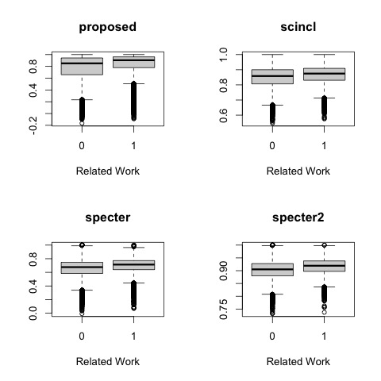

# Related Work Hypothesis

<p>
Related work hypothesis: <i>cos(a,b)</i> is larger when paper <i>a</i> cites paper <i>b</i> in a related work section than otherwise.
<p>

The plots below are based on a 1% sample of <a href="https://app.globus.org/file-manager?origin_id=1ef9019c-eac0-11ed-9ba9-c9bb788c490e&origin_path=%2F~%2Fsemantic_scholar%2FRodolfo.Zevallos%2F">rw.tsv</a>.  This sample is posted in this directory.

```sh
gunzip < rw.txt.gz | head
# rw	id1	id2	proposed	scincl	specter	specter2
# 0	54043321	14584731	0.830844	0.893716	0.667554	0.929053
# 0	54043321	11238934	0.900570	NA	0.694970	NA
# 0	56519780	18885005	0.946677	0.862260	0.484158	0.895766
# 1	154463942	153900586	0.961354	0.902879	0.733910	0.894389
# 0	154463942	152654562	0.898196	0.922143	0.821284	0.907611
# 0	143658156	143655383	0.744576	0.934965	0.845456	0.922682
# 1	15074976	9709337	0.948675	0.823861	0.522629	0.887464
# 1	15074976	5651665	0.905032	0.809045	0.674819	0.899052
# 1	27196658	25995999	0.385770	0.767261	0.536163	0.879729
```
<p>
There are about 10k rows in rw.txt.gz.  The first column (rw) is 1 for about 1/3 of the 10k rows,
and 0 for the remaining 2/3 rows.
<p>
There are some missing values (NA): 998 for proposed, 2720 for specter,
39,878 for scincl and 38,937 for specter2.  There are more NAs for scincl
and specter2 since these values are not available for papers without abstracts.
The specter embeddings were downloaded from Semantic Scholar using the bulk
download API.  They can compute specter embeddings for papers with abstracts
that they are not allowed to share.
<p>
The plots below show some evidence to support the related work hypothesis.  That is,
cosines are slightly higher when rw (the first column) is 1 than when rw is 0.
This pattern holds across four different embeddings: propoosed, scincl, specter and specter2.
<p>



The coefficients for the following regressions are all significant:

```R
x=read.table("rw.txt", header=T)
g.proposed = glm(rw ~ proposed, family=binomial, data=x)
g.scincl = glm(rw ~ scincl, family=binomial, data=x)
g.specter = glm(rw ~ specter, family=binomial, data=x)
g.specter2 = glm(rw ~ specter2, family=binomial, data=x)
```