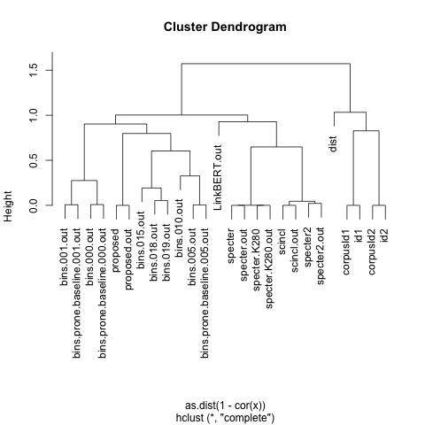

# Suggestions for random walks

See walk file under <a href="https://app.globus.org/file-manager?origin_id=1ef9019c-eac0-11ed-9ba9-c9bb788c490e&origin_path=%2F~%2Fsemantic_scholar%2Feval%2F">here</a>.

<p>
There are 3.5M rows like this:

```sh
head walk
# 1	248518397	1041744
# 2	248518397	23848439
# 3	248518397	4235810
# 4	248518397	82079949
# 1	3374228	140728989
# 1	68334187	36144275
# 2	68334187	7008060
# 1	205881482	94036919
# 2	205881482	95069173
# 3	205881482	53480264
```

We started with a random query (column 2) and then walked to one of
its references (column 3) randomly.  From there, we continued until we
couldn't go any more.
<p>
Column 1 is distance from column 2 to column 3.
<p>
The combo.V3 file under <a href="https://app.globus.org/file-manager?origin_id=1ef9019c-eac0-11ed-9ba9-c9bb788c490e&origin_path=%2F~%2Fsemantic_scholar%2Feval%2Fresults%2Fwalk%2F">here</a> contains the information above, as well as cosine scores for many systems.

<ol>
<li><ol>methods
<li> proposed, proposed.out</li>
<li> proposed method based on bins: 
bins/000.out,
bins/001.out,
bins/005.out,
bins/010.out,
bins/015.out,
bins/018.out,
bins/019.out</li>
<li> like above, but using code from nodevectors (as opposed to our rewrite):
bins/prone.baseline/000.out,
bins/prone.baseline/001.out,
bins/prone.baseline/005.out</li>
<li> scincl, scincl.out </li>
<li> specter2, specter2.out </li>
<li> specter, specter.out</li>
<li>specter.K280, specter.K280.out: like above, but downsampled from K=768 to K=280, using random projections </li>
<li> LinkBERT.out </li>

</ol></li>
<li>dist: a number between 1 and 4</li>
<li> ids: corpusId1, corpusId2, id1, id2</li>
</ol>




The embeddings above are designed to work with tools like near_embeddings.sh.
The following example is from <a href="https://github.com/kwchurch/JSALT_Better_Together/blob/main/doc/find_similar_docs.md">here</a>.

```sh
query=232040593

# Find 3 papers near $query in specter, proposed and scincl
# This is slow the first time you run it, but it gets faster
# after some warmup

echo $query | $JSALTsrc/near_embedding.sh $specter
echo $query | $JSALTsrc/near_embedding.sh $proposed 
echo $query | $JSALTsrc/near_embedding.sh $scincl
```

You can refer to any of the bins with 
```sh
echo 4209 |
$JSALTsrc/near_embedding.sh $proposed/bins/019 |
head | cut -f3 | 
$JSALTsrc/fetch_from_semantic_scholar_api.py --fields year,citationCount
# {'paperId': 'c15f33608ab05dd3174032a52aac5f44f2517bf3', 'year': 1991, 'citationCount': 10}
# {'paperId': '79b6a462e96c6a66f358efd23f479377bcccba31', 'year': 1992, 'citationCount': 26}
# {'paperId': 'fb8b0b33150ff1e47fb79f401273b36481fab9b5', 'year': 1964, 'citationCount': 1}
# {'paperId': 'd13ae9ee5a94291d75d1ed8e6eead5c831901d21', 'year': 1947, 'citationCount': 5}
# {'paperId': '8b3cb5b7dc758028cc214ce6278cbb5acfff959f', 'year': 1960, 'citationCount': 34}
# {'paperId': '122680540e7b641e8a316523648347f83d63384a', 'year': 1961, 'citationCount': 80}
# {'paperId': '8187d5645576398299a7901d257c74428753c324', 'year': 1964, 'citationCount': 7}
# {'paperId': '476eb5f792bc44548ffe03d70ffe3f6109a4e547', 'year': 1953, 'citationCount': 35}
# {'paperId': '42a533435fa24d1a4dc95ad1be2639bdd715c6ba', 'year': 1971, 'citationCount': 35}
# {'paperId': '00bd64598b53a740b6a05ff404c752b875a73407', 'year': 1981, 'citationCount': 9}
```

```sh
echo 4209 |
$JSALTsrc/near_embedding.sh $proposed |
head | cut -f3 | 
$JSALTsrc/fetch_from_semantic_scholar_api.py --fields year,citationCount
# {'paperId': 'c15f33608ab05dd3174032a52aac5f44f2517bf3', 'year': 1991, 'citationCount': 10}
# {'paperId': 'aebf0bf7e489b3004b0d8d02ec8c3ad791622020', 'year': 1984, 'citationCount': 18}
# {'paperId': '81fb3be363cbecabccf95d9f9403006a39c1ac58', 'year': 2004, 'citationCount': 31}
# {'paperId': '63ad96d240f6ca9c8d81e19bb81f12e78aa1539b', 'year': 1980, 'citationCount': 52}
# {'paperId': 'a751f495741f833d86ea66449ab4d19a6e1ccba8', 'year': 1982, 'citationCount': 34}
# {'paperId': '1bc0cc4072cb236fd04fa2bd4afb6846f54f9a45', 'year': 2004, 'citationCount': 25}
# {'paperId': '5e369c505348342d4e42caf3d033605668ee8091', 'year': 1981, 'citationCount': 18}
# {'paperId': '09bcb261cf4d1b04645c2116a1d7735c3edf8106', 'year': 1987, 'citationCount': 76}
# {'paperId': '65838bc9b10168b10967d8ccfa3578c9c81f9854', 'year': 2004, 'citationCount': 10}
# {'paperId': 'f3d4a40520d9019ba3edb6dc4d2f3c659969036f', 'year': 1984, 'citationCount': 10}
```

The following suggests that we have a problem with our implementation of ProNE.
You would hope that these would produce similar results.

```sh
echo 1505 | $JSALTsrc/near_embedding.sh $proposed/bins/005 | head
# 1.000000	1505	1505
# 0.827251	1505	84009705
# 0.437905	1505	9347027
# 0.427003	1505	83116782
# 0.319349	1505	84339215
# 0.292508	1505	251413315
# 0.276639	1505	84851271
# 0.190147	1505	192211119
# 0.174293	1505	164011658
# 0.169369	1505	39684321
```

```sh
echo 1505 | $JSALTsrc/near_embedding.sh $proposed/bins/prone.baseline/005 | head
# 1.000000	1505	1505
# 0.991313	1505	46439449
# 0.625766	1505	36770038
# 0.613597	1505	28776075
# 0.593165	1505	62815038
# 0.572116	1505	84270523
# 0.528365	1505	34734978
# 0.507157	1505	84493113
# 0.493132	1505	99883655
# 0.475946	1505	87816316
```

This finds the 10 best matches in bin 005, and then scores them by
the baseline bin, as well as the proposed method on much more data.
Note that it is hard to generalize from 5% of the data to 100%.
But it is worrisome that bin 005 is so different from its baseline.

```sh
echo 1505 | $JSALTsrc/near_embedding.sh $proposed/bins/prone.baseline/005 | head | cut -f2- | $JSALTsrc/pairs_to_cos.sh $proposed/bins/005 $proposed/bins/prone.baseline/005 $proposed
# /work/k.church/JSALT-2023//semantic_scholar/embeddings/proposed/bins/005	/work/k.church/JSALT-2023//semantic_scholar/embeddings/proposed/bins/prone.baseline/005	/work/k.church/JSALT-2023//semantic_scholar/embeddings/proposed
# 1.000	1.000	1.000	1505	1505
# 0.910	0.991	0.634	1505	46439449
# 0.630	0.626	0.241	1505	36770038
# 0.532	0.614	0.226	1505	28776075
# 0.512	0.528	0.197	1505	34734978
# 0.438	0.593	0.133	1505	62815038
# 0.421	0.476	0.213	1505	87816316
# 0.401	0.572	0.268	1505	84270523
# 0.355	0.507	0.188	1505	84493113
# 0.341	0.493	0.185	1505	99883655
```
